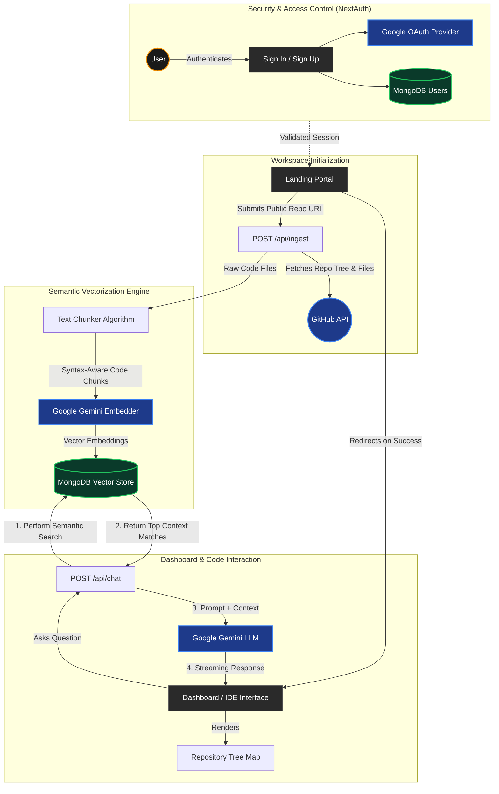

# SemanticTutor 🧠⚙️

**SemanticTutor** is an AI-powered, industrial-grade codebase analysis platform designed for modern engineering teams. By providing a public GitHub repository URL, SemanticTutor automatically ingests, vectors, and comprehends your codebase, allowing you to have deep, semantic conversations with your architecture. 

It features a high-fidelity "Industrial Precision" UI, emphasizing clarity, deep-tech aesthetics, and highly responsive workflows.

---

## ✨ Core Features

* **Deep Structural Analysis:** Input any public GitHub URL and the platform fetches, chunks, and creates vector embeddings of the codebase to enable precise semantic search.
* **Intelligent Chat Interface:** An integrated terminal-style AI chat interface powered by Google Gemini, capable of retrieving contextual code snippets and explaining complex logic.
* **Industrial Precision UI:** A highly polished, custom-built dark theme featuring burnished copper and neon orange accents (`#f08c00`), custom CSS animations (shimmers, pulsing status dots), and high-contrast typography (Source Serif 4 & JetBrains Mono).
* **Robust Authentication:** Secure session management using NextAuth (v5 Beta) supporting both Google OAuth and Email/Password credentials.
* **Caching & Rate Limiting Mitigation:** Intelligent repository updates that check GitHub commit timestamps against the database to prevent redundant vectorizations.

---

## 🛠️ Technology Stack

* **Framework:** [Next.js 16 (App Router)](https://nextjs.org/)
* **Frontend:** React 19, Tailwind CSS 4, Framer Motion (via `tw-animate-css`), Shadcn UI, Lucide React
* **Backend:** Next.js Serverless APIs
* **Database & Vector Store:** MongoDB (Native Driver `mongodb`)
* **AI & Embeddings:** Google Generative AI (`@google/generative-ai`)
* **Authentication:** NextAuth / Auth.js (`v5-beta`)
* **Form Validation:** React Hook Form + Zod

---

## 📂 Project Architecture

```text
my-app/
├── app/
│   ├── (app)/
│   │   ├── deshboard/   # Main chat & codebase explorer workspace
│   │   ├── landing/     # The repository ingestion onboarding portal
│   │   ├── signin/      # Industrial login interface
│   │   └── signup/      # Industrial registration interface
│   ├── api/
│   │   ├── auth/        # NextAuth configuration and providers
│   │   ├── chat/        # AI chatbot streaming endpoint
│   │   └── ingest/      # GitHub repo processing & embedding endpoint
│   ├── layout.tsx       # Root layout and global providers
│   └── page.tsx         # High-fidelity marketing landing page
├── components/          # Reusable UI components (Shadcn, Base UI)
├── lib/
│   ├── db.ts            # MongoDB connection utility
│   ├── github.ts        # GitHub API fetching & tree generation
│   ├── repomap.ts       # Repository map visualization logic
│   ├── text-chunker.ts  # Code chunking algorithms for vectorization
│   └── vector-db.ts     # Embeddings generation 
├── schema/              # Zod schemas for auth and API validation
└── public/              # Static assets
```

### System Architecture Flow



---

## 🚀 Getting Started

### 1. Prerequisites
Ensure you have **Node.js 20+** and **npm** or **yarn** installed. You will also need a MongoDB cluster and API keys for Google Gemini and GitHub.

### 2. Environment Variables
Create a `.env.local` file in the root of the project and add the following keys:

```env
# MongoDB
MONGODB_URI=your_mongodb_connection_string

# Next Auth
NEXTAUTH_SECRET=your_nextauth_secret
NEXTAUTH_URL=http://localhost:3000

# Google OAuth
GOOGLE_CLIENT_ID=your_google_client_id
GOOGLE_CLIENT_SECRET=your_google_client_secret

# AI API Keys
GEMINI_API_KEY=your_gemini_api_key

# GitHub (Optional but recommended to prevent rate limits)
GITHUB_TOKEN=your_github_personal_access_token
```

### 3. Installation

```bash
# Install dependencies
npm install

# Run the development server
npm run dev
```

### 4. Usage
Open [http://localhost:3000](http://localhost:3000) with your browser.
1. Sign in or create an account.
2. Enter a public GitHub repository URL into the engine (e.g., `https://github.com/facebook/react`).
3. Wait for the engine to verify and map the repository.
4. Once inside the workspace, use the terminal interface on the right to start querying the codebase!

---

## 🎨 UI/UX Philosophy

SemanticTutor does not use generic UI libraries out-of-the-box. The frontend leans heavily on **CSS perspective transforms**, **micro-shadows**, and **recessed inputs** to mimic a physical hardware interface. 

* **Typography:** `JetBrains Mono` for system metadata, coordinates, and code. `Source Serif 4` for elegant, readable headings.
* **Colors:** `#0D0D0D` and `#131313` base layers offset by `#F08C00` (Copper/Orange) highlights.

---
*Built for engineers who demand precision.*
